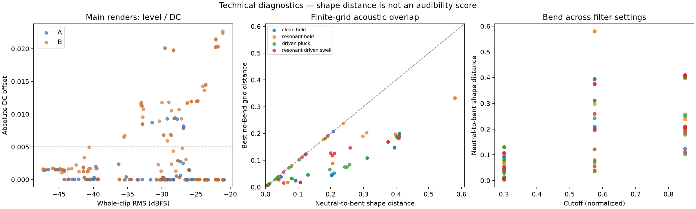

# A/B architecture comparison — measured results

[Open the listening page](../../test_renders/architecture_ab_v1/LISTEN.html) · [Protocol and limitations](../../ARCHITECTURE_COMPARISON.md)

This is an engineering comparison of the two proposed twelve-control domains.
The existing preset/profile and datasets remain the working configuration. No new
1,024-sound dataset was generated. **Audibility and perceptual usefulness remain
unrated.** The listening page begins with 12 contexts and can show all 36.

## Scope

- 36 matched contexts; 216 main renders.
- 376 distinct sound settings including stress probes and the finite reference grid.
- 450 renderer calls, including fresh-instance and serialization rerenders.
- A varies ENV2 sustain at 0/.4/1; B fixes it at 0 and varies Bend at .25/.5/.75.
- Bend **.5 is the calibrated neutral setting**, tested against A with sustain 0
  in all 36 main contexts; one case slightly exceeded the numerical tolerance below.
- Four backgrounds cross three wavetable positions with three cutoffs; background
  combinations are stress cases, not a full factorial isolation of every interaction.

## Computational outcomes

1. **Waveform activity:** 108/108 main Bend comparisons exceed the
   numerical relative-waveform threshold 0.0001. This is not an audibility result.
2. **Level:** Median absolute held-note RMS change from neutral to bent is 0.32 dB;
   maximum is 4.02 dB. Largest change occurs in `clean_held`,
   wavetable 0.5, cutoff 0.3. A fixed MIDI note/velocity does not guarantee fixed output level.
3. **Repeatability/serialization:** All 24 fresh repeats, 24 JSON round-trips and
   24 saved-preset round-trips passed; their maximum sample error was 0.
   Across these and the neutral/disabled-mode checks, 108/109 checks passed.
   See [individual checks](wrapper_checks.csv); neutral equivalence uses a separate 2e-6 tolerance.
4. **Quality:** Figures below refer to unprocessed floating-point audio. DC flags
   require review even when no clip reaches full scale. They are not corrected in
   the raw renders. See [flagged settings](quality_review.csv).

| Main renders | Count | Silent | Clipped / over range | DC flags | Maximum peak | Maximum absolute DC |
|---|---:|---:|---:|---:|---:|---:|
| A | 108 | 0 | 0 | 19 | 0.2814 | 0.00942 |
| B | 108 | 0 | 0 | 61 | 0.2814 | 0.02268 |

Flagged numerical checks:

- `B_neutral_vs_A_sustain_zero`: `B_resonant_driven_swell_w1p000_c0p850_s0p000_b0p500`, maximum error 2.3320317e-06 against tolerance 2e-06.

The flagged neutral/bypass pair has difference RMS -138.0 dBFS and relative RMS difference 2.78e-06. The original threshold failure is retained; it is separate from the exact-repeat/serialization checks. [Details](neutral_check_detail.json). No audibility conclusion is drawn.

## Acoustic overlap screen

For each non-neutral B example, the reference search varies **only wavetable and
cutoff** in the same background, with no Bend and ENV2 sustain zero. Shape distance
uses normalized band power across three time windows, so it discards uniform gain
and phase. The remaining-distance ratio is best-grid distance divided by the
original neutral-to-bent distance: lower means the grid found a closer spectral
match. It is not a percentage of variance explained or a perceptual equivalence score.

| Background | B pairs active | Median shape distance, neutral to bent | Median best-grid remaining-distance ratio | A / B DC flags |
|---|---:|---:|---:|---:|
| clean_held | 27/27 | 0.1633 | 0.484 | 1 / 16 |
| resonant_held | 27/27 | 0.1914 | 0.645 | 0 / 13 |
| driven_pluck | 27/27 | 0.1564 | 0.394 | 9 / 11 |
| resonant_driven_swell | 27/27 | 0.1563 | 0.587 | 9 / 21 |

The finite 9 x 5 grid is sparse and may miss closer settings between grid points.
A high residual cannot prove independent acoustic information; a low residual
cannot prove two sounds are perceptually interchangeable. This search also does
not test whether the complete A architecture can reproduce B. The evidence is
descriptive and does not establish that either architecture is better.

## Listening and decision

Use the native and held-note RMS-matched views. Compare B's .25/.5/.75 clips, then
A's 0/.4/1 sustain alternatives, and the expandable no-Bend reference matches.
Record clear/subtle/no/uncertain differences, the type of change, unwanted
artifacts, and which capability is more useful for the intended descriptor task.
The predeclared shortlist avoids selecting only large measured effects.

**Do not freeze B on the numerical activity count alone.** Decide after reviewing
audibility, usefulness, the capability lost by fixing ENV2 sustain, and the level/DC
tradeoffs. Keep a changed architecture as a new version if it is adopted.

Artifacts: [manifest](render_manifest.csv), [paired effects](paired_effects.csv),
[finite-grid matches](wave_cutoff_matches.csv), [summary](summary.json),
[listening shortlist](listening_shortlist.csv).

Report generated by `generation/report_architecture_comparison.py`.
