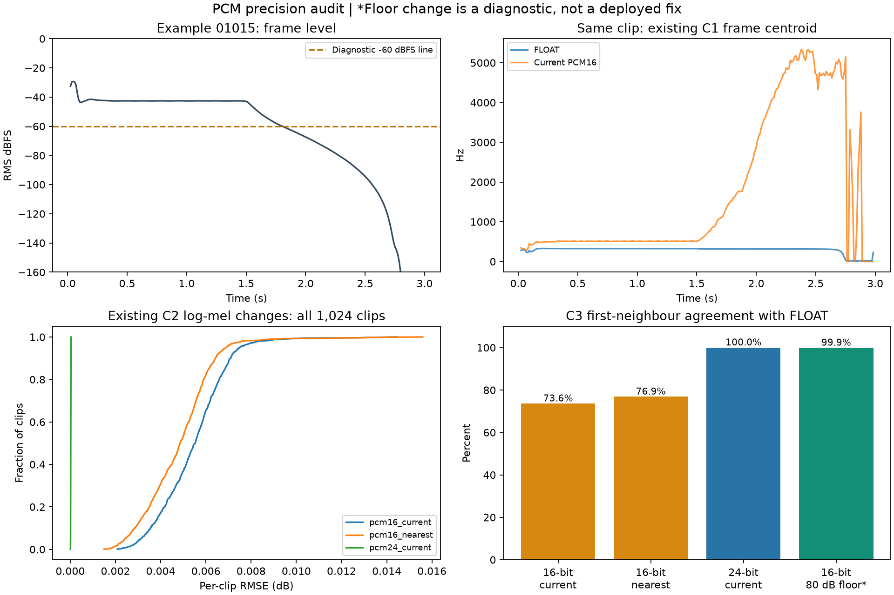

# Audio storage precision audit — 8 October 2026

**Result: PCM16 caused no clipping and very small C2 input changes in these 1,024
sounds, but it is not a drop-in replacement for the current C1/C3 feature pipeline.**
The audit exposed sensitivity to very quiet frames and spectral components. This
is a feature-definition issue as well as a storage decision. It does not establish
an audible difference, and a FLOAT-derived feature value is not perceptual ground
truth merely because it has more precision.

The existing candidate masters, selected study audio, manifests, survey bundle
and production feature extractors were not modified. The 131,072 render job was
not started and no storage format was frozen.

## What was compared

Reference: every existing mono 44.1 kHz, three-second, DC-conditioned FLOAT WAV in
`restricted_bend_sustain_v4`. The 13 controls, waveform, DC processing, duration,
sample rate and level were held constant. The only intended change was encoding.

1. Verify the source hashes against the manifest.
2. Encode/decode each waveform through an in-memory WAV using the installed
   soundfile/libsndfile stack. No approximate hand-coded PCM simulation is used
   for the current exporter.
3. Compare three alternatives: current direct PCM16 export; explicit
   round-to-nearest/ties-to-even PCM16; current direct PCM24 export. No added
   dither in any arm. The latter two are diagnostics, not adopted policies.
4. Measure peak/range violations, quantization error, held-note signal/error
   ratio, DC bias and RMS level change. Silence after note-off is excluded from
   the held-note signal/error ratio (window 0–1.5 seconds).
5. Apply the selected study's maximum gain (+14.1605 dB) to reference and encoded
   arrays to measure amplified error; do not clip either array. Count headroom
   violations separately. Also evaluate the actual 67 per-sound study gains,
   including the final participant PCM16 export.
6. Run the actual C1 17-feature extractor, C2 64-band log-mel extractor and C3
   26-value MFCC mean/std extractor on paired signals. For C1, also inspect the
   first 1.5 seconds as a tail-sensitivity diagnostic.
7. Compare C3 audio neighbours for all 1,024 queries, excluding self matches and
   using the same stable sample-index tie breaking. No MMR or human relevance
   evaluation is involved. First hold the FLOAT feature scaler fixed, then check
   the effect of fitting a new scaler for each format.
8. Verify all 1,024 inspected candidate WAVs, all 67 participant WAVs, the source
   manifest and bundle again after the main audit: **1,093 unchanged files**.

The comparison covers all available candidates, including the quietest ones; it
does not establish equivalent behaviour in the as-yet-unrendered 131,072 corpus.
Encoder edge checks include exact representable samples, saturation and explicit
nearest rounding. Every existing participant WAV was reproduced exactly by the
current FLOAT-master + recorded gain + PCM16 export route.

## Waveform and clipping results

| Measurement | Current PCM16 | Nearest PCM16 | Current PCM24 |
|---|---:|---:|---:|
| Candidates outside encoding range | 0 / 1,024 | 0 / 1,024 | 0 / 1,024 |
| Candidates reaching an encoded rail | 0 / 1,024 | 0 / 1,024 | 0 / 1,024 |
| Median error RMS, dBFS | -96.73 | -103.50 | -145.18 |
| Worst error RMS, dBFS | -94.90 | -101.41 | -143.33 |
| Lowest held-note signal/error ratio, dB | 45.43 | 51.32 | 93.55 |
| Median held-note signal/error ratio, dB | 68.61 | 74.63 | 116.97 |

Higher signal/error ratio is better; more-negative error dBFS is smaller error.
These are measured quantization errors, not microphone noise measurements or
validated hearing thresholds. The full-clip level range was -52.72 to -16.52 dBFS
RMS. The largest direct-PCM16 held-note RMS level change was only 0.00035 dB.
However, a small RMS level change does not establish unchanged spectral features.

The current direct exporter introduces a small negative mean error (median about
-9.86e-6 full-scale). Explicit nearest rounding reduces that bias and roughly
halves the maximum sample error, but does not resolve the C1/C3 feature issue.
Neither undithered scheme is being selected as the final export policy here.

### Playback gain

For the existing 64+3 selection, using an early PCM16 master and then the recorded
gain produced no clipping. The largest pre-final-encoding error was -82.74 dBFS
RMS, with worst held-note signal/error ratio 52.95 dB. After the final PCM16
playback encoding, the worst error against the current participant WAV was
-82.70 dBFS RMS (52.88 dB held-note signal/error ratio).

Applying the *same* +14.16 dB gain to every candidate would exceed full scale for
580 sounds in both the FLOAT reference and PCM case. This is an intentionally
overbroad stress calculation, **not** 580 newly clipped files and not an actual
playback rule. Gain must remain per-sound and peak constrained.

The maximum gain observed in the selected 67 is not the maximum for all future
subsets. At the current study target (-27.9862 dBFS held RMS), the full candidate
pool hypothetically needs up to **+21.73 dB**. For the quietest clip, 00460, this
raises direct-PCM16 error to **-74.97 dBFS RMS** while remaining within headroom.
Two other candidates would exceed both the 0.89 study ceiling and full scale if
matched blindly to that target. The existing preparation code computes a common
target feasible for the particular selected group; a new selection therefore
needs its own verified level plan, or an explicitly frozen globally feasible one.
No hypothetical gained clip was installed in the study.

## Feature results

### C2: small spectrogram changes, model impact untested

Using the current 80 dB-floor log-mel implementation, direct PCM16 produced:

- Median per-clip spectrogram RMSE: **0.00553 dB**.
- Worst per-clip spectrogram RMSE: **0.01445 dB**.
- Largest individual bin difference: **0.4413 dB**.
- No bin differed by more than 1 dB.
- For reference bins above -60 dB, worst per-clip RMSE was **0.00326 dB**.

This supports numerical stability of the existing C2 representation on this
pool. No 13-control network was trained or evaluated; unchanged model accuracy,
uncertainty calibration and perturbation diagnostics are not demonstrated.

### C1: substantial sensitivity in the existing extractor

Direct PCM16 changed the full-clip mean spectral centroid by up to **1,435.66 Hz**.
The worst example, `restricted_bend_sustain_v4_01015`, changed from 292.24 to
1,727.90 Hz. About **89%** of that shift came from frames below -60 dBFS RMS.

The implementation averages per-frame centroids without a meaningful energy
gate or weighting and treats magnitudes above machine epsilon as valid. The
MFCC path logs mel energies down to machine epsilon in unnormalized FFT units.
Very quiet tails and weak spectral bins consequently affect summary features
far more than their contribution to waveform energy would suggest. This is
especially relevant when quantization replaces tiny components with zeros or
quantization error.

Removing only the release tail is insufficient: in the first 1.5 seconds, the
largest PCM16 centroid shift was still 940.37 Hz, and MFCC differences remained.
The quietest held sounds and weak high-frequency energy matter as well.

PCM24 reduced the full-clip maximum centroid shift to 260.31 Hz but still changed
several current C1 MFCC summaries substantially. More bits alone do not resolve
the feature definition.

The issue also exists in the **already prepared study bundle**: directly comparing
the current 67 FLOAT feature WAVs with their actual PCM16 playback copies gave a
median centroid difference of 240.56 Hz and maximum 760.27 Hz under this extractor.
This does not invalidate the listening sounds; it means these feature values
must not be treated as a validated representation of perceived brightness.

### C3: meaningful changes in neighbours under the current features

| Encoding | Same first neighbour, fixed FLOAT scaler | Mean top-5 membership overlap | Same first neighbour after rebuilding each scaler |
|---|---:|---:|---:|
| Current PCM16 | 73.63% | 81.50% | 75.49% |
| Nearest PCM16 | 76.86% | 82.79% | 76.17% |
| Current PCM24 | 100% | 100% | 100% |

These are stability comparisons with FLOAT, not claims that the FLOAT neighbours
are more perceptually correct. In the rebuilt-scaler comparison, the direct
PCM16 top-5 overlap was 82.07%; PCM24 still preserved all top-5 memberships.

For a controlled diagnosis, only C3's normalized mel-power floor was changed
from 1e-12 (-120 dB) to 1e-8 (-80 dB), the floor already used in C2. The FFT,
mel filters, DCT and summary method were held constant. Direct PCM16 then achieved
**99.90% first-neighbour agreement (1,023/1,024)** and **99.90% average top-5
membership overlap** with its corresponding FLOAT features. The single changed
first choice lost only 0.0000245 cosine similarity under that FLOAT reference.

This is strong evidence that the current feature floor contributes to the format
sensitivity. It is not sufficient to establish -80 dB as the best perceptual
choice, and this diagnostic change has **not** been installed in production C3.
No listener labels were used to choose the diagnostic floor.



The first two panels show the same clip: as its level falls, the existing PCM16
frame-centroid estimate rises dramatically. The last bar changes the feature
floor for both FLOAT and PCM16; it compares stability within that revised
representation, not against the original FLOAT neighbour list.

## Decision and next steps

1. **Keep the current participant audio and candidate masters unchanged.** These
   results do not require re-rendering the synth or replacing the 64+3 sounds.
2. **Do not freeze direct PCM16 as a numerically interchangeable master format
   with the current C1/C3 extractors.** The claim is contradicted by this audit.
3. Specify meaningful frame-energy handling and spectral floors for C1, and a
   versioned floor for C3. Keep temporal-envelope information explicitly rather
   than allowing silent-tail numerical artifacts to stand in for it. Preserve
   the current implementations/results as historical baselines.
4. Recheck the revised representations against FLOAT/PCM16, including existing
   participant PCM16 playback, quiet clips, gain changes and controlled timbre
   changes. Stability alone is not perceptual validity; later held-out human
   judgments are still needed.
5. Then choose canonical bit depth and export/rounding/dither policy together.
   PCM16 remains a plausible storage option after this work. PCM24 is a promising
   intermediate option for current C2/C3 but does not bypass the C1 correction.
   For one full 131,072-file copy, PCM16 is about 32.3 GiB, PCM24 48.4 GiB and
   FLOAT 64.6 GiB. Keeping raw and processed copies is a separate storage choice.

No blind listening comparison was conducted in this audit. The louder-error
cases deserve targeted level-matched listening if a PCM16 master is selected;
the numeric results alone cannot prove audibility or inaudibility. Do not boost
an isolated difference signal and interpret that as normal listening evidence.

## Reproduction and evidence

Run the main audit from the repository root into a **new** output directory:

```powershell
.\venv\Scripts\python.exe -B generation/audit_pcm_precision.py --output generation/characterization/pcm_precision_repeat
```

The script refuses to overwrite an existing output directory. The focused
`generation/diagnose_pcm_features.py` script reads this original `pcm_precision_v1`
audit directory and likewise refuses to overwrite its existing diagnostic JSON.

- `summary.json`: aggregate results, input/code hashes, dependency versions,
  encoder probe and definitions.
- `waveform_errors.csv`: all 1,024 candidates × three encodings, including C2 errors.
- `selected_playback_errors.csv`: all 67 selected sounds × three encodings and
  comparison with the current final PCM16 playback route.
- `paired_features.npz`: ordered candidate IDs and paired C1/C3 feature arrays.
- `feature_diagnosis.json`: C3 floor-only experiment, existing study-copy
  comparison, full-pool gain calculation and worst C1 frame contributions.
- `centroid_frame_diagnosis.csv`, `full_pool_gain_diagnosis.csv`: per-candidate
  follow-up measurements.
- `retrieval_rebuilt_scalers.json`: additional scaler-rebuild comparison. It is
  calculated from `paired_features.npz` by applying each matrix's own column
  mean/std, row L2 normalization, pairwise cosine ranking and self exclusion.

The advisory feature-review flags in the JSON use p95 difference >0.05 corpus SD
or max >0.10 SD, and C3 first-neighbour agreement <99% or mean top-5 overlap <98%.
These are transparent engineering screens, not statistical significance tests,
hearing thresholds, or a prespecified human-study acceptance criterion. The
large observed changes justify review independently of those particular cutoffs.
